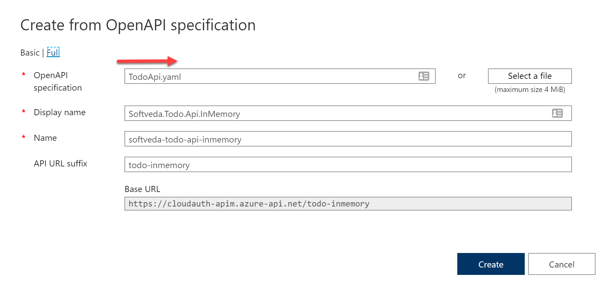
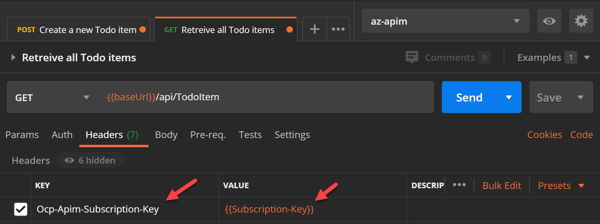

In this post I will delve into designing and building Highly Available APIs hosted on Azure App Service. 
App Service is a very popular PAAS service in Azure that is used to host web applications, REST APIs and mobile backends on either Windows or Linux based server environments. 
App Service is ultra developer friendly and at the same time offers very robust scalability and security features suitable even for large Enterprises. 

My code examples will be in C#/.Net core as that is the language I am most familiar with. 
The deployments to Azure can be done from the Azure portal, I have used Azure Cli wherever possible. 

Microsoft has a published reference architecture for [web applications](https://docs.microsoft.com/en-us/azure/architecture/reference-architectures/app-service-web-app/multi-region) but my focus is on API apps which is different. 
Often the examples shown don't take into account the security aspects in conjunction with HA. 

API apps in Azure App Service can be deployed as an ASP.Net Core application or as a function app. 
I will implement the API as a ASP.Net Core app for this post but the concept will apply to function apps in consumption tier.
A highly recommended way and adopted by most enterprises is to expose your APIs through an Azure API Management (APIM) Gateway. 
A typical API architecture will look like:


This is the key difference to a web app, the presence of Azure APIM.
Web apps do not require a APIM in front, which is why we cannot blindly use the Microsoft reference architecture.

<!-- {} -->

## High Availability (HA) Overview
Lets first start in understanding what High Availability (HA) means. 
Very simply HA is a non-functional quality attribute for a system that allows its services to be accessible even when one or more of its components have failed. 
This is extremely important for critical enterprise applications. 
Lets assume your enterprise has mobile apps or web apps accessed by thousands or millions of customers and the backend APIs are serving the frontends, if they fail it will have a significant customer and possible regulatory and financial impacts as well. 
Designing you Azure API applications to survive a failover event is critical for your company's ongoing operations and business. 
It is also important to design for HA to protect the system from deliberate security attacks like DDoS.

Two related concepts are Business Continuity (BC) and Disaster Recovery (DR). 
Designing for DR mitigates against catastrophes where entire region can fail due to natural events like flooding or earthquakes and also protects against data corruption.
Although DR is more focussed on backups and restore a good HA design will also significantly help for DR and even provides some DR benefits on its own.

HA is often measured in uptime percentage. e.g. a 99.95% monthly uptime means the system will be down for at most 30x24x60x0.0005 = 21.6 min / mo. Other metrics like Recovery Time Objective (RTO) and Recovery Point Objective (RPO) also comes into play. 

The 3 main design elements to consider for HA are
- **Redundancy** - All components that can fail should have one or more redundant instances.
- **Monitoring** - The system internally or externally should be able to measure the metrics and detect that a component has failed or degraded.
- **Failover** - A functioning redundant component can takeover the degraded or failed component and the system continues to function as usual.

If two components x & y are in series then the composite availability is the product of the individual availability.
e.g. If availability of component _x_ is _Ax_ &  availability of component _y_ is _Ay_ then overall availability is _AxAy_.
If two components are in parallel then the composite uptime is _1 - (1-Ax*Ay)^2_.

### HA API architecture
Let me first present the maximum Multi-Region HA API architecture before I describe it in details:


The above design provides HA when an entire region fails. 
E.g. If primary App Service fails all API requests will still be made to the secondary App Service. This is shown by the solid green lines.

It also caters for backend failure. If one of the App Service instance stops the API as experienced by the client will still be available online. This is shown by the dotted green lines.

### Azure HA API Design Options
In Azure any cloud service can often fail unexpectedly and even entire zones and regions (i.e. Cloud DataCenters) can fail or become unavailable. 
Design for reliability is a core tenet in the [Azure Well-Architected Framework](https://docs.microsoft.com/en-us/azure/architecture/framework/#reliability)
The primary means to build a HA system is to deploy azure services to multiple regions or zones (where available).

Designing for HA means that each of the components (i.e. Azure services) have to be redundant. 
We only have two components here; the APIM and the App Service. 
Lets check the redundancy options we have for each component.
- **App Service**: This one is easy, we need a minimum of two instances, one each in different Azure regions. Lets call them primary and secondary region.
- **APIM**: Here we have a choice to use two APIM instance one in each region or most likely in an enterprise scenario you are using APIM Premium tier which supports redundant gateways in different regions in a single instance. Lets choose this option. 

[SLA](https://azure.microsoft.com/en-au/support/legal/sla/api-management/v1_4/) for multi-region premium tier APIM (x) is 99.99% and [SLA](https://azure.microsoft.com/en-au/support/legal/sla/app-service/v1_4/) for App Services (y) is 99.95%.
In our architecture we have x & yz in series but then they are mirrored across two regions in parallel.
Using our formula the system availability is _1-(1-Ax*Ay)^2 = 99.99%_, this is 4-nines availability or 52 minutes/year downtime only.

The thing that still remains is how to configure APIM to connect to App Service backend with automatic failover. 
We will need to load balance traffic between the two regional App Service instances. 
Azure provides several [load balancing (LB) options](https://docs.microsoft.com/en-us/azure/architecture/guide/technology-choices/load-balancing-overview). 

- **Traffic Manager (TM)**: TM provides DNS based load balancing. It is a highly available (99.99%) global service and thankfully we do not have to think about making this component multi-region. It is also very cheap, costs $0.54 per million DNS queries and $1/month per Azure endpoint.
- **Azure Front Door (AFD)**: It can be an alternate option but here it will be an overkill and certainly much more expensive.
- **Azure Load Balancer (ALB) & Application Gateway (AppGw)**: ALB operates at layer 4 of OSI stack and the best for LB HTTP traffic. AppGw operates at layer 7 and is recommended for HTTP traffic. But these services are themselves regional and cannot do multi-region load balancing. 

So for the simplest cost-effective design the best LB option is TM.

## The API code
The API is a simple TodoItem API implemented in ASP.Net Core 3.1, the idea of which I borrowed from this [tutorial](https://docs.microsoft.com/en-us/aspnet/core/tutorials/first-web-api?view=aspnetcore-3.1&tabs=visual-studio). 
The code is available on [Github](https://github.com/clouddevauthority/CloudAuthority.TodoApi).

I plan to have different storage backends for this API in future, like Table storage, CosmosDB and SQL Server. 
To start with the API stores the resource entities in memory. This of course means the primary and secondary instances will return different TodoItem resources. 
But for the purpose of part 1 this should suffice. 
To know which instance is returning the data I have added a bit of code in `startup.cs`. 
It uses an inline middleware to add the "WEBSITE_SITE_NAME" environment variable in a custom response header. 
This environment variable is automatically set in Azure App Service to be the same as the name of the App Service instance.
The code to inject this value is shown below.

```C#
private static readonly string siteName =
    Environment.GetEnvironmentVariable("WEBSITE_SITE_NAME") ?? "localhost";

public void Configure(IApplicationBuilder app, IWebHostEnvironment env,
                      ILogger<Startup> logger)
{
  ...
  // Inject Azure App Service name in a custom response header
  // to know from which App Service the response is returned
  app.Use(async (context, next) =>
  {
    context.Response.Headers.Add("APP-SERVICE-SITE-NAME", siteName);
    await next.Invoke();
  });
  ...
}
```
I have used the  [Swashbuckle](https://docs.microsoft.com/en-us/aspnet/core/tutorials/getting-started-with-swashbuckle?view=aspnetcore-3.1&tabs=visual-studio) library to add the OpenApi configuration. This adds an endpoint to the API to generate the OpenApi (previously known as Swagger) spec.
The Swagger configuration is in the `ConfigureServices` method in `Startup.cs` file.
Configure the middleware in the `Configure` method as shown below.

```C#
app.UseSwagger();
if (env.IsDevelopment())
{
  app.UseSwaggerUI(c =>
  {
    c.SwaggerEndpoint("/swagger/v1/swagger.json", "Todo API InMemory v1");
    c.RoutePrefix = string.Empty; // To serve the Swagger UI at the app's root 
  });
}
```
To learn more about OpenApi here is a lighting talk I gave at DDD Melbourne by night.



The API has two endpoints, the first is for TodoItem resource `<baseUrl>/api/TodoItem` and the other for health check `<baseUrl>/health`
The two controllers implementing the endpoint are `TodoItemController.cs` and `HealthController.cs`

To generate the OpenApi specs YAML and JSON file install the Swashbuckle Cli .Net tool and then run the command from the src folder.

```bash
dotnet new tool-manifest
dotnet tool install --version 5.4.1 Swashbuckle.AspNetCore.Cli

dotnet swagger tofile --output ../src/api/Softveda.Todo.Api.InMemory/OpenApi.yaml --yaml ../src/api/Softveda.Todo.Api.InMemory/bin/Debug/netcoreapp3.1/Softveda.Todo.Api.InMemory.dll v1
dotnet swagger tofile --output ../src/api/Softveda.Todo.Api.InMemory/OpenApi.json ../src/api/Softveda.Todo.Api.InMemory/bin/Debug/netcoreapp3.1/Softveda.Todo.Api.InMemory.dll v1
```

Run the API from Visual Studio locally hosted in IIS Express. It should open the swagger UI in your web browser as below.


You can even test the API methods from this UI.
Now that we go the API running locally, the next step is to host and deploy it in Azure.

## Azure hosting and deployment

### App Service configuration
I have created two App Services one in each region in their own plan using the Standard S1 tier. 
This is the minimum tier that can be load balanced using TM. 
It is a small limitation but I assume most enterprises would be using Standard or Premium plans anyway.
The regions you should choose for HA/DR are the designated [region pairs](https://docs.microsoft.com/en-us/azure/best-practices-availability-paired-regions). 
Region pairs are connected by dedicated low-latency networks and planned maintenance updates are never done in simultaneously. 

THe script to do this is in `scripts\createazurewebapp.sh`

The ARR Affinity settings is turned off as shown. 
This setting enables a session cookie and should be turned off for load balanced stateless APIs.


The environment variables can be inspected by opening the console and entering the command `env` as shown below.
Note the WEBSITE_SITE_NAME environment value.


### Build and deploy the API
Deploy the TodoItem ASP.Net Core API app to both the primary and secondary App Services.
You can deploy by publishing from withing Visual Studio or using Azure CLI.
I run my CLI commands and script from WSL2 Ubuntu Linux.
The script to do this from WSL2 is in `deploywebapp.sh`

```bash
#!/bin/bash

srcPath=../src/api/Softveda.Todo.Api.InMemory
rm -rf $srcPath"/pub"
dotnet publish -o $srcPath"/pub" $srcPath"/Softveda.Todo.Api.InMemory.csproj"
cd $srcPath"/pub"
zip site.zip *
cd -
test -f $srcPath"/pub/site.zip" && echo "deployment zip package exists."

rgName=todoapi-rg
appPrefix=todoapi-inmemory
az webapp deployment source config-zip -g $rgName -n $appPrefix"-pri" --src $srcPath"/pub/site.zip"
az webapp deployment source config-zip -g $rgName -n $appPrefix"-sec" --src $srcPath"/pub/site.zip"
```

### Traffic Manager configuration
The TM configuration is quite simple. First create a TM and the configure it.

Select the performance routing method as this should mean the closest endpoint will be resolved to the APIM gateway based on the region.
Change the path to /Health. This is important as this path will have no access control applied.


Add two TM endpoints where the two App Services are the target. 


The two endpoints should show up as Online.


The script to create TM is `scripts\createazuretrafficmanager.sh`

I have deployed the App Services and TM to their own Azure resource group like the following:


THis shows we have created two App Service plans, two App Services and one TM, till now.

### API Management Configuration.
Create a new APIM instance in a separate resource group.
The APIM instance should be Premium tier with 2 scale units one in each region but that would blow my MSDN budget so I had to use the Developer tier. 
_Remember only the Premium tier have the multi region scale unit support with 99.99% uptime SLA._
Note that APIM has a Virtual IP address, this is the outbound IP address from which all calls to backends originates. 
This can be used in an allowlist for access control purpose.


Publish the TodoItem API in Azure APIM from the OpenApi spec yaml file as shown below. 



Go to settings and change the Web Service URL to be that of the Traffic Manager.
I also added an API URL suffix as in want to publish many other APIs on this APIM.


At this point you should be able to test the API Health endpoint as shown below.
Notice the app-service-site-name response header which shows that this response was sent from the primary App Service.


The script to create APIM is `scripts\createazureapim.sh`

## Test the API
I love using [Postman](https://www.postman.com/) to test APIs. A postman collection for this API is available in the Test folder, `TodoApiInMemory_postman_collection.json`
Import the collection in Postman. Alternately create a new collection by importing the OpenApi yaml file.

Create an environment to test Primary App Service and save the baseUrl parameter value.


Now test the POST method to create a new Todo item, it should work and return HTTP 201 response.


Test the GET method to make sure the API returns the newly created Todo item.
This conclusively proves that the API is working.

Create a second environment for Secondary App Service and test as well.

To test APIM create another environment. 
APIM needs a subscription key in a header named Ocp-Apim-Subscription-Key. If it is not supplied a HTTP 401 (Access Denied) error will be returned. 
Get the value from APIM -> Subscriptions menu in Azure portal.


Add this as a parameter to the environment and use it in a request header as shown below.




Test the API again and it should work this time.

We have a long way to create & configure Azure services deploy our API to make it HA.
BUt there remains some security issues that we still need to improve.

## Security Design
One of main rationale to expose enterprise APIs through APIM is that APIM provides a central place to govern your published APIs and enforce various policies. 
The design has to ensure that the APIs cannot be directly called by clients bypassing APIM. 
Unfortunately App Service (unless deployed as ASE) is a public PAAS service in Azure and always exposes a public listening endpoint on the internet (*.azurewebsites.net). 
If someone knows about this endpoint URL they can directly call this API. 
The design goal is to allow TM to probe the /Health endpoint and yet block any access to the api/TodoItem endpoint. 
This is shown as the solid red line on the architecture diagram.
i.e. prevent the traffic flow in red and only allow the traffic flow in green.

The two primary methods to enforce a layer of security access control on App Service are:
- **Client Certificate**: This method ensures that the caller has to present a client certificate when connecting to the App Service as part of TLS handshake.
- **IP Restriction**: This method ensures that only caller from an allowed list of IP addresses can call the App Service.

Both the above methods have problems when used in a TM based load balancing solution. 
This is because TM doesn't support client certificates when it does health probing and TM probes can be considered to be originating from internet with a wide range of IP Addresses. 
Although Microsoft publishes the [TM IP addresses](https://azuretrafficmanagerdata.blob.core.windows.net/probes/azure/probe-ip-ranges.json) I wouldn't use them for an IP based ACL. 
IP addresses can be spoofed and allowing such a large range of IP addresses is not recommended. 
Moreover if Microsoft does add or remove IPs then there is no good way to react to that change and update the ACL automatically.

There is of course the question of adding authentication (AuthN) and authorization (AuthZ) to the API as well. 
That is important and I will incorporate that in later posts, but access control is very important as a defence in depth mechanism which is the focus of this post.

### Securing the API Endpoint
All that remains now is to secure the /api/TodoItem endpoint. 
As I have earlier written I am going to use mutual TLS (mTLS) with Client Certificates to secure that endpoint.
For an excellent description of mTLS please read here on [cloudflare blog](https://blog.cloudflare.com/introducing-tls-client-auth/). 

Configure the App Service in general settings section to require Client certs, excluding the path /Health.
This ensures that if the client certs are not present in the request App Service will send back HTTP 403 forbidden response.
If client certificate is present it will forward the cert in header to the API app.


### Client Certificates
In mTLS the server, in this case App Service, requires a certificate from the client as part of TLS handshake.
I have created self signed certificates using powershell 7.0 as I am testing on Windows 10 and need to import the certs in Windows Certificate Store. 
Check the file `scripts\createcertificates.ps1`
The script creates a Root cert and then uses that to sign and create a Client cert.
The Root cert with private key is the root_ca_cloudauth-apim.azure-api.pfx file. 
Just double click the file and follow the prompts. This will install it in "Personal" store.
The Client cert is child_ca_cloudauth-apim.azure-api.pfx file. This must be installed in to Windows User Certificate "Personal" store as well. 

It is also possible to create self-signed certs in WSL2 using openssl as well. Check the file `scripts\createcertificates.sh`.
If using WSL2 copy the generated certs to windows folder and install as above.

After importing open Windows User Certificate Manager from control panel and check the User Certificate Store.
Cut the root ca cert from "Personal" folder and paste it in "Trusted Root Certification Authorities" folder.
Find and open the client cert and copy the thumbprint. See below.


### Update the code to check client certificates
Azure App Service can be configured to require client certs in the incoming request and forward it to the API.
App Service has its own load balancer which terminates the SSL connection and starts a new connection with its own backend web workers which hosts the apps. 
This is described in detail [here] (https://docs.microsoft.com/en-us/archive/msdn-magazine/2017/february/azure-inside-the-azure-app-service-architecture).
App Service can only require a cert but cannot check of this is the client cert the app is expecting.
App Service forwards the client cert as a base64 encoded string in a custom header named X-ARR-ClientCert.
The API code should deserialise this string to a X.509 certificate and check for properties like subject, issuer and thumbprint to make sure the values are as expected.
First add some configuration settings for the expected values in `appsettings.json`.

```json
"CertificateConfig": {
    "Header": "X-ARR-ClientCert",
    "Subject": "CN=cloudauth-apim.azure-api.net, O=CloudAuthority, C=AU",
    "Issuer": "CN=azure.cloudauhtority.dev, O=CloudAuthority, C=AU",
    "ThumbPrint": "b997cedf455791cb1c0741f9aff90a0e7d8041f5"
  }
```
I have written a middleware to validate the certificate in `ClientCertValidationMiddleware.cs`.
The code skips the validation check if the request path is "/Health" as the health check endpoint should not be protected by client certs.
The rest of the code deserialises the certificate from the X-ARR-ClientCert header and then compares the properties of the certificate to the values in configuration.
If the comparison succeeds the middleware would invoke the next delegate to continue the request pipeline, otherwise it will return HTTP 403 (Forbidden) error.

```C#
public async Task InvokeAsync(HttpContext context)
{
  _logger?.LogInformation("ClientCertValidationMiddleware Executing");
  // Skip check on health check endpoint
  if (string.Compare(context.Request.Path, "/Health", comparisonType: StringComparison.OrdinalIgnoreCase) == 0)
  {
    await _next.Invoke(context);
    return;
  }
  try
  {
    var certHeader = context.Request.Headers[_config.Header];
    var clientCertBytes = Convert.FromBase64String(certHeader);
    var certificate = new X509Certificate2(clientCertBytes);
            
    var isValidCert = IsValidClientCertificate(certificate);

    if (!isValidCert)
    {
      _logger.LogWarning("Invalid Certificate: Request Forbidden");
      context.Response.StatusCode = (int)HttpStatusCode.Forbidden;
      return;
    }
    await _next.Invoke(context);
  }
  catch
  {
    _logger.LogWarning("Certificate Exception: Request Forbidden");
    context.Response.StatusCode = (int)HttpStatusCode.Forbidden;
  }
}
```
Add the middleware in Configure method in Startup.cs.

```C#
if (!env.IsDevelopment())
{
  app.UseClientCertMiddleware();
}
```

Note that the middleware is only added if the environment is not Development. 
This is because it is a bit arcane to setup IIS Express with client certs, but it can be done, search on internet if you are interested.
If you are hosting it in kestrel then it is easier, indeed I have some code to do it.
Check CreateHostBuilder method in `Program.cs`.

```C#
webBuilder.ConfigureKestrel(o =>
{
  o.ConfigureHttpsDefaults(o =>
    o.ClientCertificateMode =
        ClientCertificateMode.RequireCertificate);
});
```
If you run the API in console using dotnet cli then to call the API you will need a client cert for localhost. 
You can generate a self-signed one following the previous steps.

Build and deploy the updated API code to App Services.

### Securing the Health endpoint
*Updated on 07/08/2020*

There is a small concern that the Health endpoint is exposed to the world and anyone who discovers it can call the endpoint as there is no client certificate check on this endpoint.
A simple way to mitigate this concern is to pass a secret key to the health endpoint and check that key in the Controller action. 
In the real world the key should be stored in Azure key vault. For simplicity I am using the client cert thumbprint as the secret key and storing it the appconfig.
Make this change in TM. The monitoring path should be ```/Health/{key}```
The key can be passed as an header as well, but that will prevent a quick test using a browser so I have added it to the route. Traffic manager supports setting custom header.

If you do this code will look like this:

```C#
public class HealthController : ControllerBase
{
  private readonly string HealthCheckKey;

  public HealthController(ILogger<HealthController> logger, IConfiguration configuration)
  {
    HealthCheckKey = _configuration.GetSection("HealthCheckKey").Value;
  }

  public ActionResult<string> GetHealthCheck([FromRoute] string key)
  {
    _logger.LogInformation("Checking Health of Application");
    if (string.CompareOrdinal(key, HealthCheckKey) != 0)
    {
      return Forbid();
    }

    return Ok("HealthCheck OK");
  }
}
```

### Test the secured API 
Test the App Service endpoint from a Windows 10 PC and edge chromium browser. 
Just browse to the the primary App Service endpoint, the browser will prompt to choose a client certificate from your personal store, select the one you created earlier.
It should succeed proving that the client certificate settings are configured properly.


If you now test the API calls to Primary or Secondary App Service or APIM using Postman it would fail with HTTP 403 error.
This is the security control we wanted to block the calls from internet to the App Service API endpoint.
If the attacker does not have the correct client certs the API would response with a HTTP 403 error.


To use client certificates when calling this URL import the client cert pfx file in postman settings -> certificates as shown below.


Test the API on Primary and Secondary environment and it will be successful but the call to APIM would still fail. 
This is because APIM has not yet been configured to send the client cert in the request to backend.

### Configure Client Certificate in APIM
To use client certificate in APIM the first step is to upload the certificate as shown:


Then configure the Backend policy to select "Client cert" in Gateway credentials and select the cert you just uploaded, as shown below.


Do the above and use Postman to test the API with APIM and it should now work. 
Note that there is no need to add client cert in Postman settings for APIM URL as APIM gateway doesn't require client cert. 
The client cert is required in APIM for the backend only.

That is it; we have now secured the APIs with access control as well as made them highly available, in the simplest way possible. 

### A section on DR
I have ignored DR in this architecture as there is no persistent data store used by the API. 
We have used premium tier APIM with multi-region scale units, this ensures that at least one APIM gateway will be available even if an entire region fails. 
The same applies to the App Services as there are two instances one in each region.

The APIM service configuration should be backed up to a geo-replicated storage account container and can be restored from there in a DR event. [See details here](https://docs.microsoft.com/en-us/azure/api-management/api-management-howto-disaster-recovery-backup-restore)

### Alternate HA API Architecture
The architecture I described above uses a Premium tier APIM for maximum availability.  
In non-enterprise scenario or dev/test environments where the cost of Premium tier APIM is not justified it is possible to achieve HA using two basic or standard tier APIM as shown below:


In this alternate design two separate APIM instances are created one in each region and another TM instance is created to load balance the two APIMs.
This has more components to fail and may add more latency in the end-to-end flow due to multiple layers of DNS lookups. 
It will also require to keep the two APIM instances in sync. 
I haven't tested this but as the APIs are published and policies are applied independently to two different APIM instances it can cause transient failures  or inconsistencies in the system as a whole.

## Summary
Thanks for following this post and reaching to the end. 

In this post I described the architecture for a secure HA API hosted in Azure using App Services, APIM and TM. I went through the design rationale, code, deployment, configuration and, testing. Hope you find it helpful.

I will continue to expand on this architecture in later posts to include virtual networks and storage as well. 

This is my first technical post and I tried to be as detailed as possible because I feel that Azure beginners should be able to understand as well. 
If it feels too long please excuse me.
