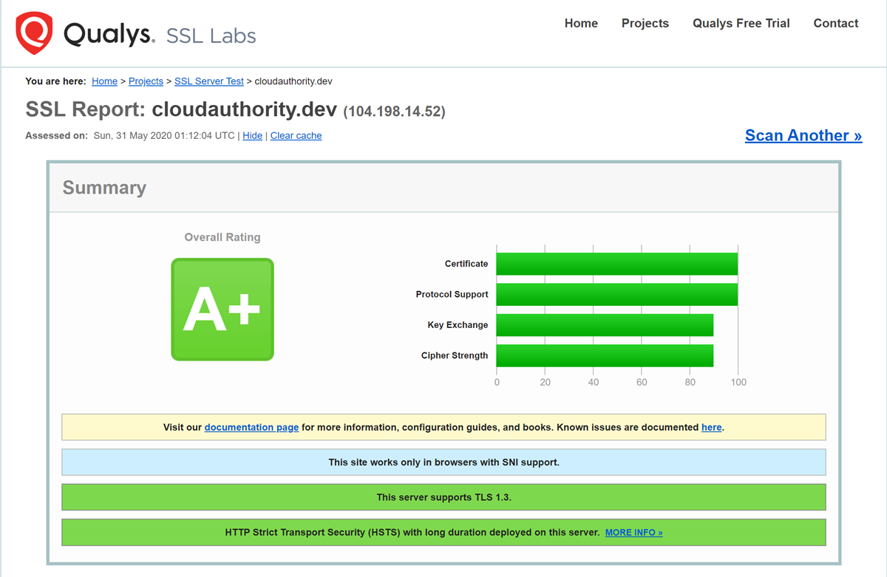
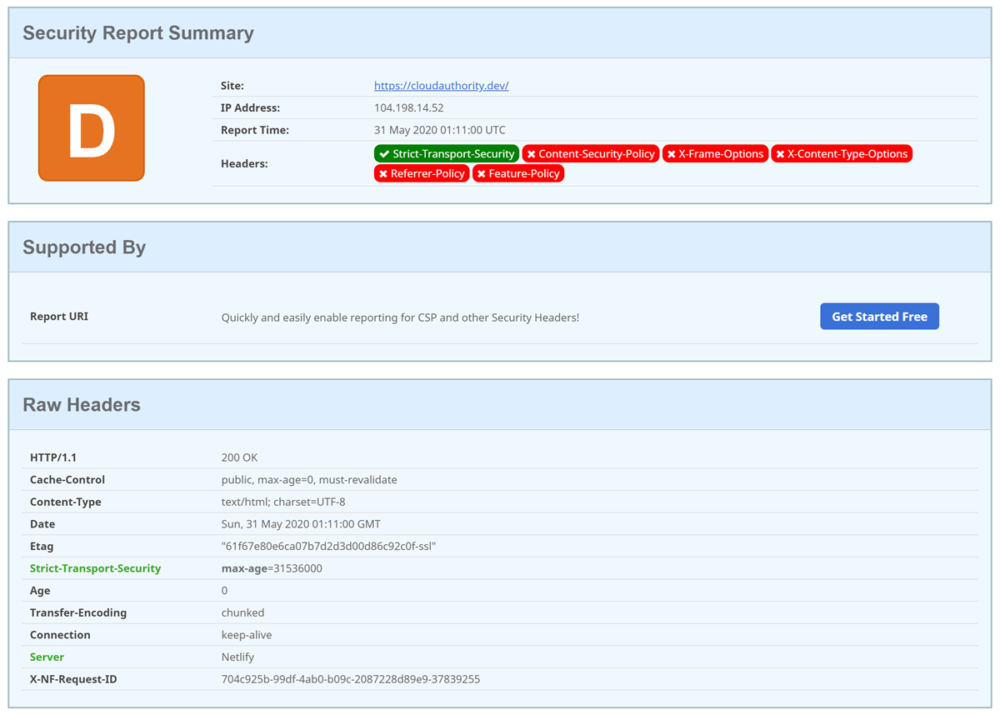
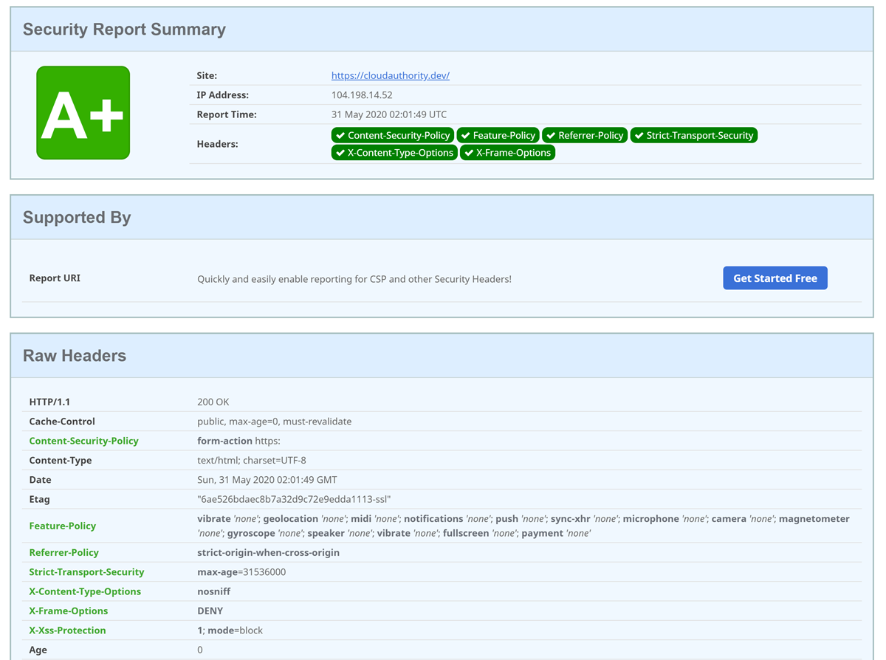

## Cloud Authority - My new blog

Welcome to my new blog, with some trepidation I am posting my first blog post at nearly the stoke of midnight on June 1, 2020.
Primarily I am going to write on technology that I get to work with daily or learning as a Cloud Architect, like Azure, APIs, Microservices, DevOps, AppSec etc.
I will also write my opinions on thoughts on IT industry in general as I observe it.
I want to throw in reviews of books, articles, tools etc. I come across as well.

I don't claim you will find something fundamental or original here, there are many competent bloggers and technology masters out there, who will write on the same topics, perhaps more eloquently.
But I will bring my own perspective and  I hope you will get something useful out of this.

This is my second attempt at starting a Blog. I tried once about 3-4 years back, and I wasn't committed enough to sustain it, I even lost the domain.

I am now working from home due to the COVID 19 situation and decided I will try once more to write a blog.
I admit that part of the reason is to do personal branding but mostly I really want to share some of what I learn and discover.
I find that speaking or presenting something enforces the learning.

## Tech stack of the blog

I bought the **cloudauthority.dev** domain name last year from Google domains.
I have read that you should own the domain of the blog and host it on the apex domain.
I was convinced that I want to use static web site generators and content would come from GitHub.
I also want to have free or extremely cheap hosting with a very simple deployment workflow.
I read and researched for over a month, there are just too many choices and I again procrastinated for too long.
I am not a front-end developer and was looking for a simple content authoring as well.

Finally I settled on [Visual Studio Code](https://code.visualstudio.com) as editor, [GitHub](https://github.com) for content, [Hugo](https://gohugo.io) for blogging framework, [Academic](https://sourcethemes.com/academic/) for theme, [Netlify](https://www.netlify.com) for hosting and [Cloudflare](https://www.cloudflare.com/dns/) for DNS

Just as I was about to launch the blog, Microsoft announced [Azure Static Web Apps](https://docs.microsoft.com/en-us/azure/static-web-apps/overview) at Build 2020.
For a brief moment I was tempted to switch from Netlify, but I didn't.
Azure Static Web Apps is too new, there is no indication for pricing and it didn't support apex domain.
Also Netlify supports Hugo out of the box without having to setup any build and deploy steps.
So Netlify it is. I may re-visit this decision in future.

## Configuring Security for the blog

I am an avid follower of [Troy Hunt's](https://www.troyhunt.com) blog and have taken a keen interest on web security. I wanted to secure my blog as best as I can in the beginning and continue to make to better later.

### SSL configuration check

Netlify automatically enables TLS certificates with [Let's Encrypt](https://letsencrypt.org).
I checked the SSL configuration with [SSS Labs](https://www.ssllabs.com/ssltest/).
The result was **A+** as shown below.
First check passed.

### Security headers check

[Scott Helme](https://scotthelme.co.uk/) has written about security headers such as CSP and HSTS that increases the security of a web site and prevents many common attacks like XSS and MITM.
He runs a online tool called [SecurityHeaders](https://securityheaders.com) where you can scan your site.
The first result wasn't that good. I got a **D** as the site was missing many headers.

After tweaking the Netlify.toml file to add response headers I was able to get an **A**.
The final result is shown below.
I will continue to tune this as I go.

### Performance check

I also checked the performance of the site using 
The result is not very great, I will try to optimise the performance, but for now I am happy to publish the blog.

